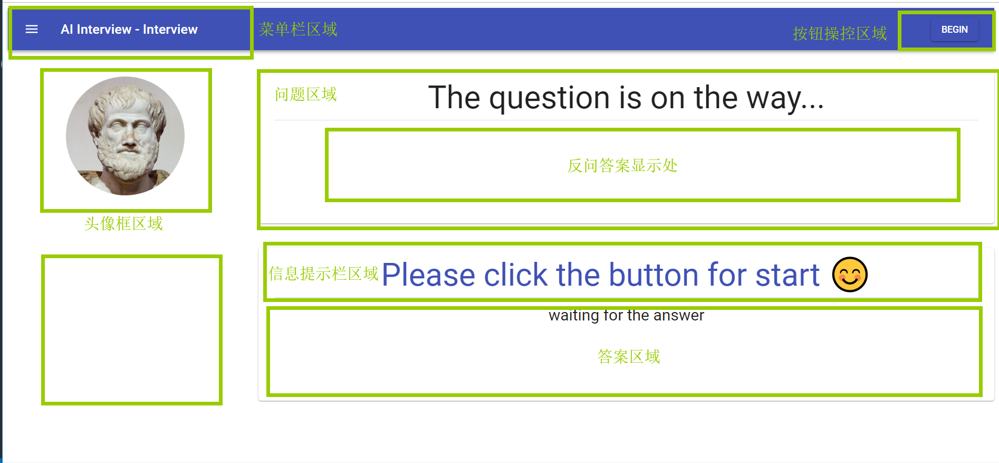
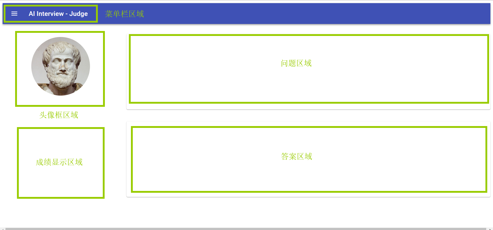
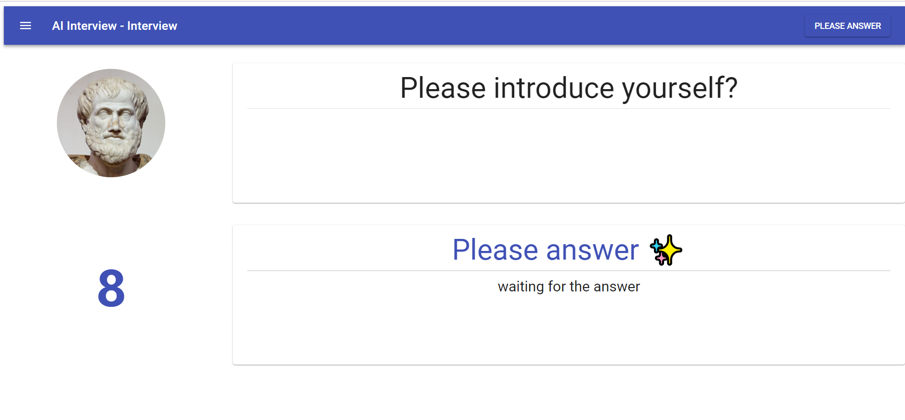
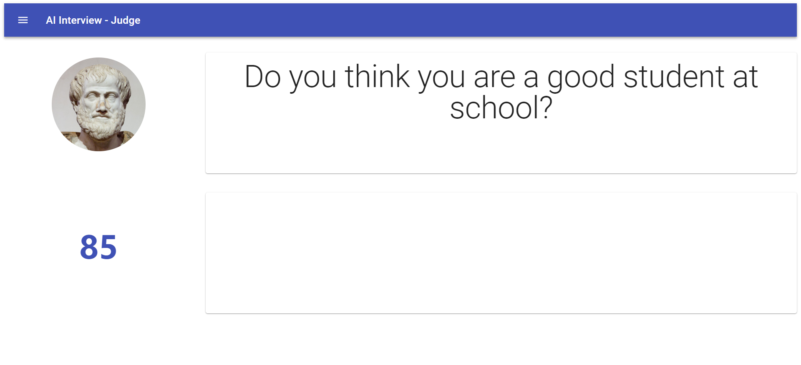
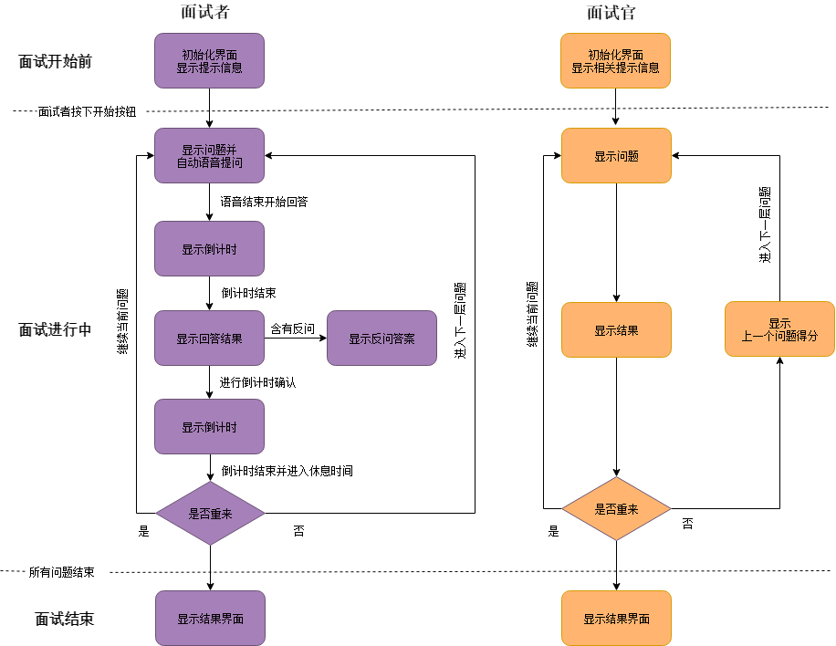

# AI Interview - 界面概况

> ### 功能概况:  
> **1.面试者界面**:  
> + 面试者进去该页面后台初始化界面,并显示相关提示界面,头像信息显示在头像区域;  
> + 面试者按下开始系统从后台获取初始问题并自动读出问题区问题的语音;
> + 语音结束计时按钮开始计时,系统自动启动麦克风录音功能,面试者开始当前问题作答;
> + 作答结束系统将语音转化成文字返回显示在回答区域;
> + 此时计时区域开始确认答案倒计时,系统在该时间内语音识别是否要重新该
问题作答;
> + 休息时间
> + 重新作答则保持该问题不变重复上述过程
> + 不重新作答则进入下一层问题的作答
> + 全部问题回答完毕显示所有问题的答案及得分  

> **2.面试官界面**:  
> + 在面试者作答期间同步显示当前不问题以及当前回答的问题
> + 成绩区域显示上一个问题的实时得分
> + 面试者完成全部问题显示所有问题的答案及得分情况

###  一、 界面
#### 1.整体界面
##### 2.1 面试者

##### 2.2 面试官

#### 2.区域及功能
##### 2.1 面试者

 + **菜单栏区域**
 > 目前无明确功能 

 + **头像框区域**
> 显示面试官(面试人)的头像

+ **计时区域**
> 1.回答问题倒计时  
> 2.确认问答无误倒计时

+ **操控按钮区域**
> 1.用于开始自动化流程面答  
> 2.按钮上显示的文字提示当前流程

+ **提示栏区域**
> 1.用于当前流程的相关提示信息显示  

+ **问题区域**
> 1.显示当前需要回答的问题
> 2.显示面试者回答问题中的反问问题答案

+ **答案区域**
> 1.显示当前问题回答者的答案  

##### 2.2 面试官
 + **菜单栏区域**
 > 目前无明确功能 

 + **头像框区域**
> 显示面试官(面试人)的头像

+ **成绩显示区域**
> 1.显示上个问题的成绩得分情况

+ **问题区域**
> 1.显示面试者当前需要回答的问题

+ **答案区域**
> 1.显示面试者当前需要回答的问题的答案

#### 3.关键流程相关界面
##### 3.1 初始化面试开始前提醒界面
> 暂无

##### 3.2 面试开始后回答中界面

##### 3.3 面试结束后成绩显示界面
> 暂无

###  二、 流程
